<h1 align="center">Olá, eu sou o Vinicius Kenedy 👋</h1>

<h3 align="center">
Desenvolvedor Web Júnior | ADS - UNINTER | Python • JavaScript • HTML • CSS • SQL
</h3>

---

  

---

### 👨‍💻 Sobre mim

Sou desenvolvedor em formação, estudante de **Análise e Desenvolvimento de Sistemas na UNINTER**, com foco em desenvolvimento web, banco de dados, suporte técnico e resolução de problemas.

Tenho conhecimentos em **Python, JavaScript, HTML5, CSS3, SQL, MySQL, SQL Server, Git, GitHub, Docker, redes de computadores e manutenção de computadores**.

Atualmente busco oportunidades como **estagiário ou desenvolvedor web júnior**, aplicando disciplina, aprendizado contínuo e experiência prática em tecnologia.

---

### 🚀 Tecnologias

  

---

### 🌐 Contato

  
  
  

---

  <strong>Em busca de oportunidades para crescer como Desenvolvedor Web Júnior 🚀</strong>

